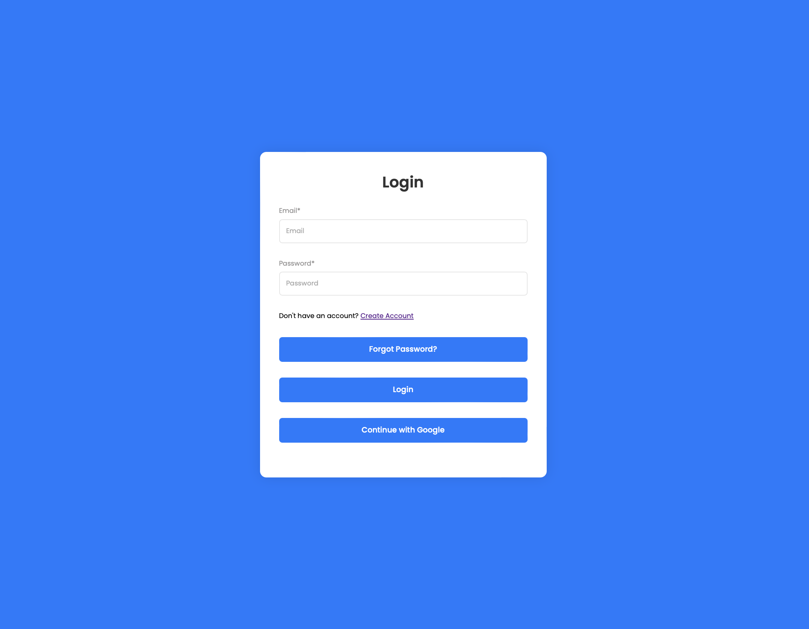
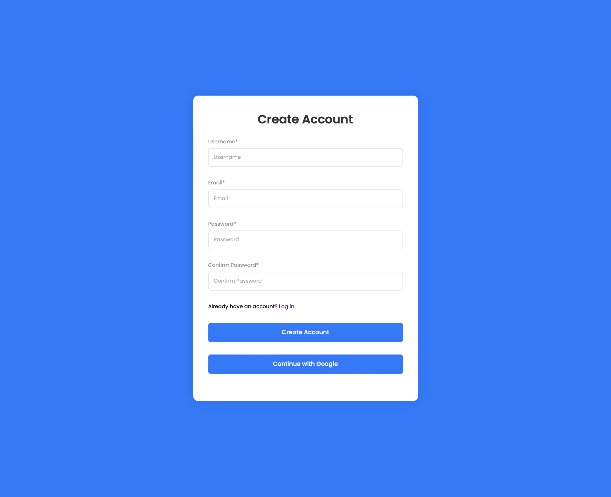
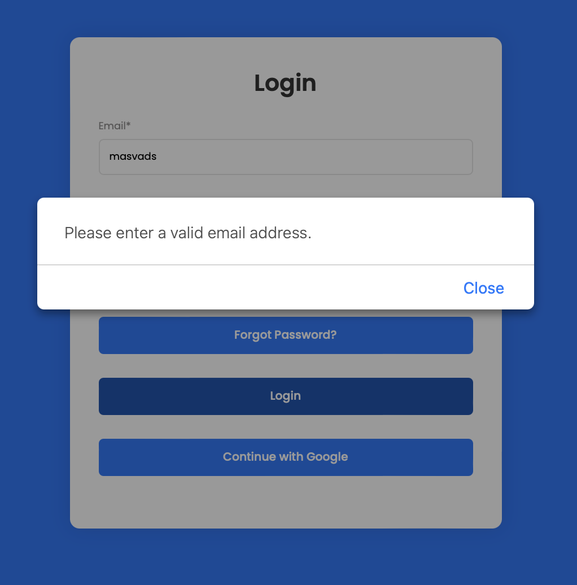
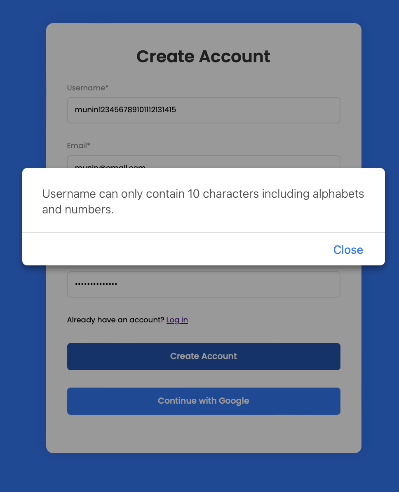
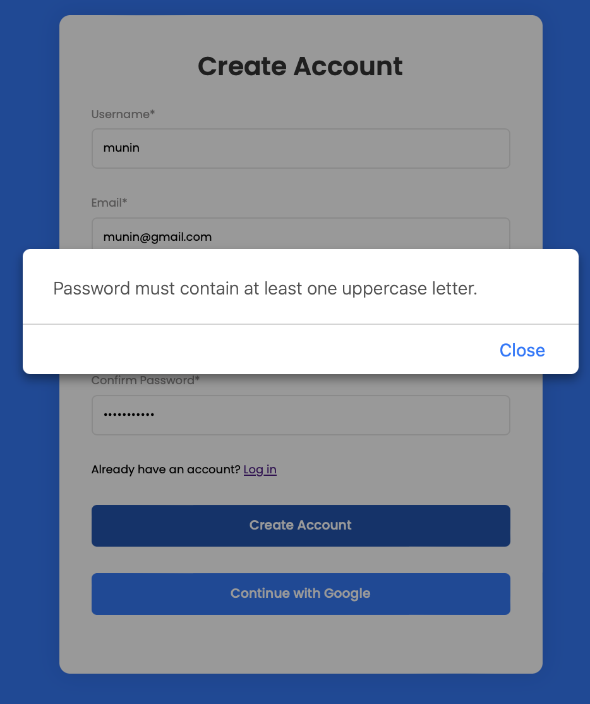
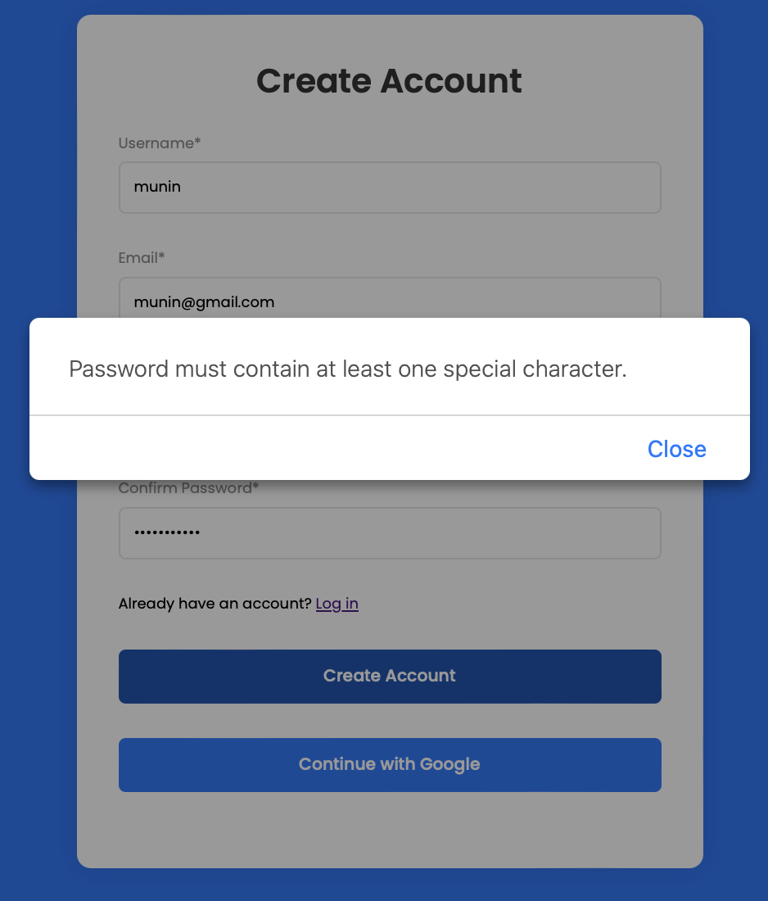
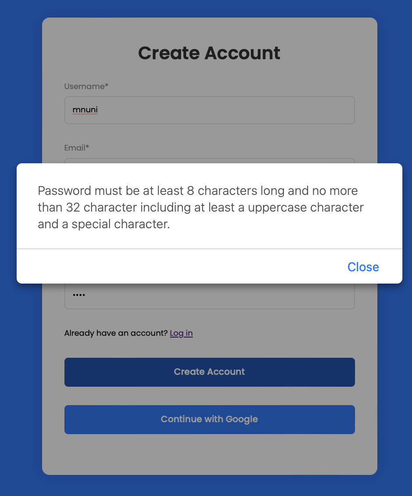

# SDS-TaskManagement

## Introduction

The project focuses on task management, offering users an improved solution for managing tasks with effective functions. With more visibility of the teamwork environment, the system allows users to work and communicate confidentially within the association. However, a system is not only about functionalities therefore Implement security into the system's design from the beginning is significant.

## Defining User

1. **Admin ( of the System)**
    - Has the highest privileges monitoring the system.
2. **User**
    - Every user are promoted to be admin by default when they register account (Note that admin here is not admin of the system). There privileges only cam manage their own account and other actions under their account. They can manage their projects that are created by them such as `assign tasks to other user` and `monitor on their project`.
    - Based on that and to understand more about the system, we can seperate user account into two group seperately.
        - They are **Leader**(if the account has created the own projects).
        - They are **Member**(if the account is added to project and assigned task to them).
        
    - **Functions (Leader)**
        - Input Project names.
        - Input tasks.
        - Input deadline.
        - Input Status.
        - Assign task owner.
        
    - User that are invited to project created by other user, can only manage on tasks that are assigned to them.
    - **Functions (Member)**
        - View assigned Project and Tasks.
        - Update task status (Mark task done).

## Authentication

Authentication plays a crucial role in ensuring the security and privacy of the user data. It is like a first security layer to prevent user from any change in actions to the data. This involves verifying the identity of users or systems accessing your application. Strong authentication mechanisms, such as multi-factor authentication (MFA) or biometric authentication, can help prevent unauthorized access. 

**Firebase** support various provider authentication methods such as email/password, phone number, and OAuth providers like Google, Facebook, and Twitter. By depending on third party it is more reliable to enssure a security layer for users.

In this application there are two type of authentication with google firebase. which are: `(username/password)` and `Federate Authentication (oAuth)`.

## Availability

Availability ensures that your web application remains accessible and operational for legitimate users, even in the face of various challenges such as distributed denial-of-service (DDoS) attacks or hardware failures. This might involve implementing redundancy and failover mechanisms to maintain service continuity.

To ensure the availability we consider of implementing redundancy by duplicating critical components such as database, sever to automatically switch to backup systems if primary systems fail. Redundancy ensures that there are backup resources available to maintain service continuity.

Since the application is built with firebase hence, the availability also handle by google provider.

## Confidentiality

Confidentiality refers to protecting sensitive data from unauthorized access or disclosure. This can be achieved through encryption techniques, access controls, and secure data storage practices. 

- **Encrypt sensitive user data** both in transit and at rest. Firebase provides TLS encryption for data in transit, Hence we can use Firebase Security Rules to restrict access to sensitive data stored in Firestore, Realtime Database, or Firebase Storage.

## Integrity

Integrity ensures that data remains accurate and unaltered during storage, transmission, and processing. Techniques like cryptographic hashing and digital signatures can help verify the integrity of data and detect any unauthorized modifications.

- Firebase provide strong hash algorithm in defult, before the passwords are stored in Firebase Authentication. This ensures that passwords are securely hashed and cannot be easily reversed.
- Firebase Security Rules enforce data validation and integrity constraints within your Firestore or Realtime Database, preventing unauthorized modifications or deletions.

## Non-Repudiation

Non-repudiation prevents parties from denying their actions or transactions. By implementing measures such as digital signatures and audit trails, you can establish accountability and ensure that users cannot deny their involvement in certain activities.

- Leverage Firebase Authentication's built-in features for logging user authentication events and actions. This creates an audit trail that can be used to trace back user activities and verify their actions.
- Implement transaction logs or event sourcing mechanisms to record all significant transactions or changes within your application.
- Utilize digital signatures or timestamping services to ensure the authenticity and integrity of important documents or transactions, providing evidence that can be used to verify the origin and validity of data or actions.

## Implementation



## This is aiming to achive a secure system base on the four concepts in system design security.

## Authentication
- Firebase support various provider authentication methods such as email/password, phone number, and OAuth providers like Google, Facebook, and Twitter. By depending on third party it is more reliable to enssure a security layer for users. 


## Confidentiality
- Encrypt sensitive user data both in transit and at rest. Firebase provides TLS encryption for data in transit, Hence we can use Firebase Security Rules to restrict access to sensitive data stored in Firestore, Realtime Database, or Firebase Storage.
- Implement end-to-end encryption for sensitive communications within your application, especially for messaging or file sharing functionalities.
- Utilize Firebase Cloud Functions or server-side logic to handle encryption and decryption processes, ensuring that encryption keys are securely managed.


## Intergrity
- Firebase provide strong hash algorithm in defult, before the passwords are stored in Firebase Authentication. This ensures that passwords are securely hashed and cannot be easily reversed.
- Firebase Security Rules enforce data validation and integrity constraints within your Firestore or Realtime Database, preventing unauthorized modifications or deletions.
- Implement checksums or digital signatures for critical data exchanges between client and server to detect tampering or unauthorized modifications.
- Regularly audit and monitor data access and modification logs to detect any suspicious activities that may compromise data integrity.


## Non-repudiation
- Leverage Firebase Authentication's built-in features for logging user authentication events and actions. This creates an audit trail that can be used to trace back user activities and verify their actions.
- Implement transaction logs or event sourcing mechanisms to record all significant transactions or changes within your application.
- Utilize digital signatures or timestamping services to ensure the authenticity and integrity of important documents or transactions, providing evidence that can be used to verify the origin and validity of data or actions.
- Educate users about their responsibilities and actions within the application, emphasizing the importance of maintaining the confidentiality and integrity of their credentials and data.


## Implementation
1. **Form Validation**
   This is to deal with frontend, user only interact with client-side however we don't know what user will input in the form there for it is crucial to implement various form validation logic into the system. The form validation follow the rule such as:
- `Email validation` : follow the standard email format.
- `Username validation` :
     ```
      - check empty field.
      - username must not over 10 character.
      - check username input during register acccount.
     ```
- `Password validate` :
    ```
      - check empty field.
      - must be longer than 8 and no more than 32.
      - must contains at least one upper case.
      - must contains at least one special character.
      - only accept english upper and lower alphabet with numbers and special character.
    ```

2. **User Registration**
```
- Request user to input password twice if two input doesn't match, the process will be interupt by requesting input the same password.
- User's password will be hash with strong algorithm.
```

3. **User Login**
```
- Login with email and password.
- Login with google. (federate authentication)
- User can reset when forget password, and the reset link will be sent via email.
```

## Testing
Let's demostrate see how it handle various input error.
1. **Email Validation**
   When User doesn't input a correct email format it will popup on the interface "Please enter a valid email adress."
   
2. **Registration Input validation**
When creating account it goes check up all the condition, it proceed suceeed only when match with the requirement. "
 - `giving username = munin123456789101112131415`


 - `giving password = munin123! (with special character)`


- `giving password = Munin123 (without special character)`

  
- `giving password = 1234`



   
